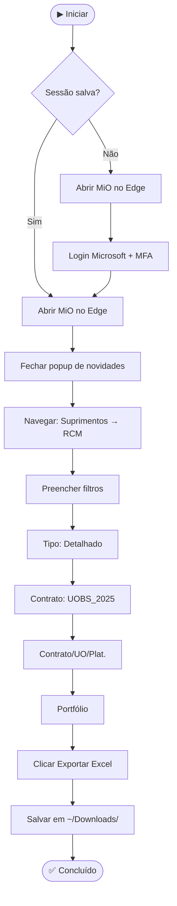

# 📥 rcm-download

Automação para download do relatório **RCM** do sistema [MiO](https://mio.app.br/), com login via Microsoft (MFA), preenchimento automático de filtros e exportação do Excel — tudo com um único comando.


---

## ✨ O que faz

- Abre o Microsoft Edge automaticamente
- Faz login no MiO via conta Microsoft (MFA incluído)
- Fecha popups de boas-vindas do sistema
- Navega até **Suprimentos → RCM**
- Preenche os 4 filtros automaticamente:
  - Tipo → `Detalhado`
  - Contrato → `UOBS_2025`
  - Contrato/UO/Plat. → `UOBS_2025 - P-68 - PETROBRAS - EDISE`
  - Portfólio → `P68-2026-PP`
- Clica em **Exportar em Excel** e salva o arquivo em `~/Downloads/`
- Reutiliza a sessão salva — **sem MFA nas próximas execuções**

---

## 🔄 Fluxo de execução



---

## 📋 Pré-requisitos

| Requisito | Versão mínima |
|-----------|--------------|
| Python | 3.9+ |
| Microsoft Edge | qualquer versão recente |
| Acesso ao MiO | conta com permissão no módulo RCM |

---

## 🚀 Instalação

### Mac

```bash
# 1. Clone o repositório
git clone https://github.com/robertorezendejr/rcm-download.git
cd rcm-download

# 2. Crie o ambiente virtual e instale as dependências
python3 -m venv .venv
.venv/bin/pip install -r requirements.txt

# 3. Configure suas credenciais
cp .env.example .env
# Edite o .env com seu e-mail e senha
```

### Windows

```batch
rem 1. Clone o repositório
git clone https://github.com/robertorezendejr/rcm-download.git
cd rcm-download

rem 2. Duplo clique em:
instalar_windows.bat
```

---

## ⚙️ Configuração

### 1. Arquivo `.env`

Copie o `.env.example` e preencha com suas credenciais:

```env
EMAIL=seu.email@empresa.com.br
PASSWORD=sua_senha
```

> ⚠️ **Este arquivo nunca é enviado ao GitHub** — está no `.gitignore`.

### 2. Arquivo `config.json`

Ajuste os filtros do relatório conforme necessário:

```json
{
  "url": "https://mio.app.br/",
  "tipo": "Detalhado",
  "contrato": "UOBS_2025",
  "contrato_uop": "UOBS_2025 - P-68 - PETROBRAS - EDISE",
  "portfolio": "P68-2026-PP",
  "download_path": "~/Downloads"
}
```

| Campo | Descrição |
|-------|-----------|
| `tipo` | Tipo do relatório (`Detalhado` ou `Resumo`) |
| `contrato` | Código do contrato no MiO |
| `contrato_uop` | Contrato / UO / Plataforma |
| `portfolio` | Código do portfólio |
| `download_path` | Pasta de destino — `~/Downloads` funciona no Mac e Windows |

---

## ▶️ Como usar

### Mac

```bash
cd rcm-download
./.venv/bin/python main.py
```

### Windows

Duplo clique em **`rodar_rcm.bat`**

---

## 📂 Estrutura do projeto

```
rcm-download/
├── main.py                  # Ponto de entrada — orquestra todo o fluxo
├── config.json              # Parâmetros do relatório (filtros, URL, pasta)
├── .env                     # 🔒 Credenciais (não vai ao GitHub)
├── .env.example             # Modelo do .env
├── requirements.txt         # Dependências Python
├── instalar_windows.bat     # Instalador para Windows (rodar 1x)
├── rodar_rcm.bat            # Atalho para rodar no Windows
├── modules/
│   ├── browser.py           # Ciclo de vida do Edge e sessão
│   ├── login.py             # Login Microsoft + MFA
│   ├── navegacao.py         # Navegação até o RCM via fnc_nav_url()
│   ├── download.py          # Filtros Select2 + exportação Excel
│   ├── config.py            # Carregamento de config.json e .env
│   ├── logger.py            # Log em arquivo
│   ├── progress.py          # Mensagens no terminal
│   └── utils.py             # Utilitários (screenshots, cliques)
├── tools/
│   ├── inspecionar.py       # Ferramenta interativa de inspeção de seletores
│   └── descobrir.py         # Descoberta automática de seletores
├── downloads/               # Arquivos Excel gerados (ignorados pelo Git)
└── logs/                    # Logs e screenshots de erro (ignorados pelo Git)
```

---

## 🔒 Segurança

- Credenciais ficam **apenas no `.env`** — nunca no código
- A sessão do navegador é salva em `storage_state.json` (também ignorado pelo Git)
- Em caso de erro, um screenshot automático é salvo em `logs/screenshots/`

---

## 🐛 Solução de problemas

| Sintoma | Solução |
|---------|---------|
| Edge abre e fecha rápido | Verifique o `.env` — e-mail ou senha incorretos |
| "Opção X não encontrada" | Verifique o `config.json` — o valor pode ter mudado no sistema |
| MFA expira antes de concluir | Normal na primeira execução — você tem 2 minutos para aprovar |
| Sessão expirada | Delete o `storage_state.json` e rode novamente |

```bash
# Forçar novo login (Mac)
rm storage_state.json

# Forçar novo login (Windows)
del storage_state.json
```

---

## 📄 Licença

Uso interno — Estrutural Engenharia.
